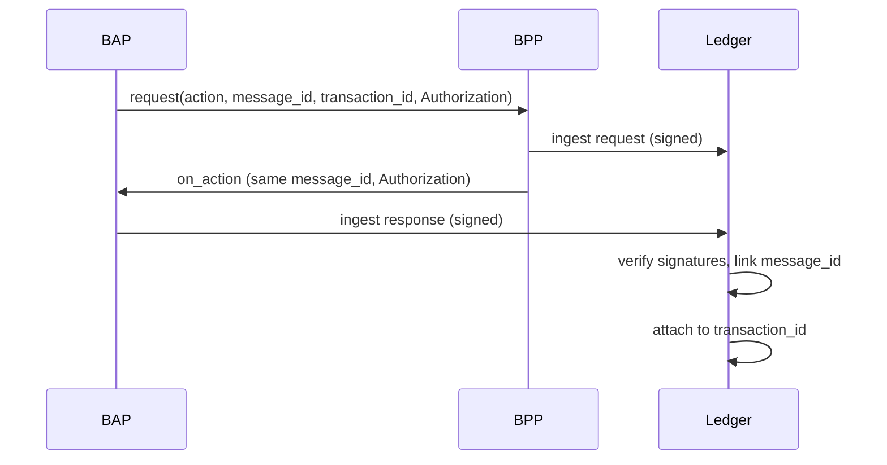
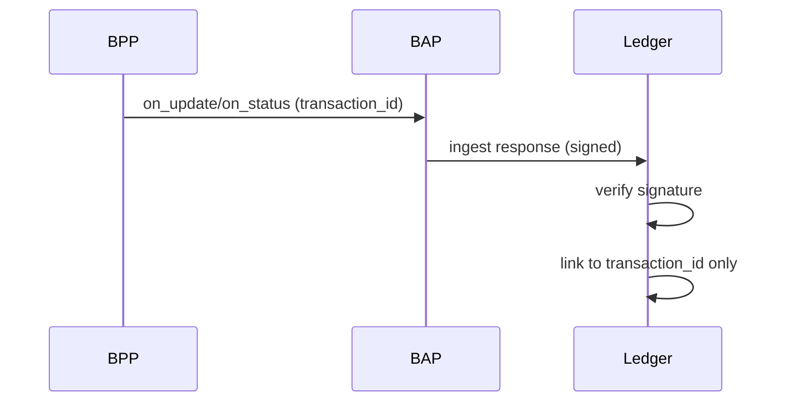
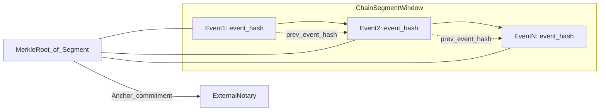

# Transaction Ledger Design for Beckn Protocol

## 1. Purpose
Design a transaction ledger system that records Beckn protocol requests and callbacks, verifies signatures, enables end-to-end transaction reconstruction, and supports disputes. The ledger must be immutable, queryable, and capable of storing enough evidence to prove message integrity and authenticity.

This design aligns with Beckn HTTP signing guidelines for Authorization headers, including BLAKE-512 digest and ed25519 signatures. In Beckn 2.0, only the `Authorization` header is used for signing and verification. Reference: [Signing Beckn APIs in HTTP](https://raw.githubusercontent.com/beckn/protocol-specifications/refs/heads/master/docs/BECKN-006-Signing-Beckn-APIs-In-HTTP-Draft-01.md).

## 2. Scope
The ledger records and correlates the following request/response pairs:

- discover -> on_discover (BAP -> CDS, CDS -> BAP)
- select -> on_select
- init -> on_init
- confirm -> on_confirm
- update -> on_update (may be unsolicited from BPP)
- status -> on_status (may be unsolicited from BPP)
- track -> on_track
- rating -> on_rating
- support -> on_support
- cancel -> on_cancel

## 3. Key Rules for Correlation
1. `message_id` is shared within a request/response pair (e.g., select and on_select).
2. `transaction_id` is shared across all pairs in the transaction.
3. `on_update` and `on_status` can be unsolicited from BPP and may not have a matching request, but still carry the same `transaction_id`.

## 4. Goals and Non-Goals

### Goals
- Immutable, tamper-evident event storage.
- Fast retrieval by `transaction_id`, `message_id`, participant, and time.
- Evidence-grade storage of signatures and verification results.
- Dispute lifecycle with evidence attachments and decisions.

### Non-Goals
- Acting as a live protocol gateway or enforcing protocol execution.
- Replacing subscriber registries or key management services.

## 5. Participants and Trust Model
Participants are BAPs, BPPs, and CDS. Each message is signed by the sender with their private key and verified using the sender's public key from a registry.

The ledger does not authenticate on behalf of parties; it records the signature inputs, verification result, and provides a tamper-evident audit trail.

## 6. End-to-End Transaction Construction

### 6.1 Steps
1. Ingest all HTTP requests and callbacks as immutable `LedgerEvent`s.
2. Parse the `context` from the body, extract `message_id`, `transaction_id`, `action`, `bap_id`, `bpp_id`, and timestamp.
3. Compute/record digest and capture raw headers including signature fields.
4. Verify the signature using the sender's public key and record verification results.
5. Link request/response pairs by `message_id` and `action` + `on_action`.
6. Link all pairs under `transaction_id`.
7. Allow unsolicited responses to join by `transaction_id` even if no matching request exists.

### 6.2 Sequence Diagram (Typical Pair)



### 6.3 Sequence Diagram (Unsolicited on_update/on_status)



## 7. Signature Verification Analysis
The Beckn signing spec requires signing each HTTP message independently using digest of the message body and `(created)`, `(expires)` fields, and verifying using the sender's public key. It does not require the response signature to be computed over the original request payload. The correlation is via `message_id` in the `context` and not via the signing string.

Therefore:
- **Standard behavior:** Each message is verified independently against its own body and headers.
- **Ledger requirement:** Store the exact raw body and signature headers for each message. The ledger does not need the original request payload to verify a response signature.
- **Correlational integrity:** To ensure a response relates to a request, use `message_id` and `transaction_id` matching rules, and validate `action` to `on_action` mapping. The ledger can optionally enforce that a response referencing a message_id exists (except for unsolicited on_update/on_status).

References: [Signing Beckn APIs in HTTP](https://raw.githubusercontent.com/beckn/protocol-specifications/refs/heads/master/docs/BECKN-006-Signing-Beckn-APIs-In-HTTP-Draft-01.md).

## 8. Ledger Architecture

### 8.1 Event-Sourced Model
All messages are recorded as immutable events. Each event includes:
- Raw HTTP headers and body.
- Calculated digest and signature inputs.
- Verification result and key lookup metadata.
- Derived fields for indexing (transaction_id, message_id, action, participants).

### 8.2 Tamper-Evident Chain
Each event is chained via a hash pointer:
- `event_hash = hash(prev_event_hash || event_canonical_hash)`
- The `prev_event_hash` links each event to the immediately prior event, creating a tamper-evident chain.
- The `event_hash` commits to both the current event (via `event_canonical_hash`) and the previous event (via `prev_event_hash`); changing any historical event breaks all subsequent hashes.
- Build periodic Merkle roots over contiguous segments of the same chain (e.g., all events in a partition window or chain shard).
- Anchor those Merkle roots externally (public blockchain or trusted timestamping) so the full chain segment has a verifiable, time-stamped commitment.



### 8.3 Retrieval Strategy
Maintain read-optimized indexes:
- `transaction_id -> [event_ids...]`
- `message_id -> [event_ids...]`
- `participant -> [event_ids...]`
- `action -> [event_ids...]`
- Time-based partitions (e.g., daily or hourly buckets) to bound query scans and manage retention.
- Time-based batching for Merkle anchoring can follow the same window (e.g., hourly batches) and include all events ingested in that window, regardless of transaction.

Time-based partitions and retrieval:
- Store events in partitions keyed by `received_at` (e.g., `events_2025_01_16` or `events_2025_01_16_13`).
- Each partition has its own local index and optionally a partition-level Merkle root for that window.
- Queries with time filters first resolve the relevant partitions, then scan only those partitions and intersect with secondary indexes (transaction_id, message_id, participant, action).
- For point-in-time audits, select the partition window, fetch the partition Merkle root, and use per-event hashes plus the anchored root to prove integrity.

## 9. Data Model

### 9.1 Core Entities
- `LedgerEvent`: Immutable record of one HTTP request or callback.
- `MessagePair`: Logical pairing of request and response by `message_id`.
- `Transaction`: Collection of `MessagePair`s and unsolicited callbacks sharing `transaction_id`.
- `Participant`: Subscriber info cached from registry (public keys, roles).
- `Dispute`: Claim involving a transaction or message pair.
- `Evidence`: Attached data for dispute resolution.

### 9.2 LedgerEvent Fields (Essential)
- `event_id` (uuid)
- `received_at` (timestamp)
- `direction` (ingress/egress)
- `sender_id` (subscriber_id)
- `receiver_id`
- `action` (select, on_select, etc.)
- `transaction_id`
- `message_id`
- `context_timestamp`
- `raw_headers` (string map)
- `raw_body` (string)
- `digest` (computed, base64)
- `signature_header` (Authorization)
- `signature_verified` (boolean)
- `signature_error` (string)
- `public_key_id` (from keyId)
- `public_key` (optional cache)
- `hash_chain_prev`
- `hash_chain_self`

## 10. Dispute Handling
Disputes are tied to `transaction_id` or `message_id`:
- `OPEN` -> `EVIDENCE` -> `REVIEW` -> `RESOLVED`
- Evidence includes raw signed messages, registry snapshots, and verification traces.
- Each dispute action is logged as immutable events.

## 11. Immutable Storage Options

### Option A: Permissioned Blockchain (e.g., Hyperledger Fabric)
- Pros: Strong immutability and multi-party consensus.
- Cons: Operational complexity, cost, lower throughput.

### Option B: Append-Only Log with Hash Chain + WORM Storage
- Store events in an append-only database.
- Periodically seal blocks into WORM storage (e.g., S3 Object Lock).
- Pros: Cost-effective, high throughput.
- Cons: Requires careful operational controls.

### Option C: Tamper-Evident Database with Merkle Anchoring
- Use standard DB for events + hash chain.
- Build a Merkle tree over a batch of event hashes; the Merkle root is a single hash that commits to all events in the batch (any change to any event changes the root).
- Periodically anchor the Merkle root to an external notarization system (public blockchain or trusted timestamping) so the commitment cannot be altered retroactively without detection.
- Pros: Flexible, performant.
- Cons: Depends on external anchoring discipline.

## 12. API Specifications (OpenAPI 3.0.3)

Below is a detailed OpenAPI-style specification for the ledger service. It is intentionally focused on ledger ingestion, retrieval, and dispute management, and can be expanded as required. For readability, each endpoint includes a short description, and schemas are kept compact and reusable.

```yaml
openapi: 3.0.3
info:
  title: Beckn Transaction Ledger API
  version: 1.0.0
servers:
  - url: https://ledger.example.com
paths:
  /ledger/events:
    post:
      summary: Ingest a signed Beckn request or callback
      description: Stores the raw HTTP message, derives identifiers, and verifies the signature.
      requestBody:
        required: true
        content:
          application/json:
            schema:
              $ref: '#/components/schemas/LedgerEventIngest'
      responses:
        '201':
          description: Event stored
          content:
            application/json:
              schema:
                $ref: '#/components/schemas/LedgerEventStored'
        '400':
          description: Invalid payload
          content:
            application/json:
              schema:
                $ref: '#/components/schemas/Error'
    get:
      summary: Query ledger events by filters
      description: Returns a paged list of events matching the provided filters.
      parameters:
        - in: query
          name: transaction_id
          schema: { type: string }
          description: Filter by transaction_id
        - in: query
          name: message_id
          schema: { type: string }
          description: Filter by message_id
        - in: query
          name: action
          schema: { type: string }
          description: Beckn action (e.g., select, on_select)
        - in: query
          name: sender_id
          schema: { type: string }
          description: Subscriber ID of sender
        - in: query
          name: receiver_id
          schema: { type: string }
          description: Subscriber ID of receiver
        - in: query
          name: from_time
          schema: { type: string, format: date-time }
          description: Start of time window (received_at)
        - in: query
          name: to_time
          schema: { type: string, format: date-time }
          description: End of time window (received_at)
        - in: query
          name: limit
          schema: { type: integer, default: 50 }
          description: Max results per page
        - in: query
          name: cursor
          schema: { type: string }
          description: Pagination cursor from previous page
      responses:
        '200':
          description: Paged results
          content:
            application/json:
              schema:
                $ref: '#/components/schemas/LedgerEventPage'
  /ledger/transactions/{transaction_id}:
    get:
      summary: Retrieve full transaction timeline
      description: Returns all message pairs and unsolicited callbacks for a transaction.
      parameters:
        - in: path
          name: transaction_id
          required: true
          schema: { type: string }
      responses:
        '200':
          description: Transaction details
          content:
            application/json:
              schema:
                $ref: '#/components/schemas/TransactionView'
        '404':
          description: Not found
  /ledger/message-pairs/{message_id}:
    get:
      summary: Retrieve request/response pair and verification status
      description: Returns the request/response pair for a message_id with correlation status.
      parameters:
        - in: path
          name: message_id
          required: true
          schema: { type: string }
      responses:
        '200':
          description: Message pair details
          content:
            application/json:
              schema:
                $ref: '#/components/schemas/MessagePairView'
        '404':
          description: Not found
  /ledger/participants/{subscriber_id}/keys:
    get:
      summary: Retrieve cached public keys for a subscriber
      description: Returns cached keys used for signature verification.
      parameters:
        - in: path
          name: subscriber_id
          required: true
          schema: { type: string }
      responses:
        '200':
          description: Key list
          content:
            application/json:
              schema:
                $ref: '#/components/schemas/ParticipantKeys'
  /ledger/disputes:
    post:
      summary: Open a dispute for a transaction or message pair
      description: Creates a dispute record for a transaction_id or message_id.
      requestBody:
        required: true
        content:
          application/json:
            schema:
              $ref: '#/components/schemas/DisputeCreate'
      responses:
        '201':
          description: Dispute created
          content:
            application/json:
              schema:
                $ref: '#/components/schemas/Dispute'
    get:
      summary: List disputes
      description: Returns disputes filtered by status and identifiers.
      parameters:
        - in: query
          name: status
          schema: { type: string }
        - in: query
          name: transaction_id
          schema: { type: string }
        - in: query
          name: message_id
          schema: { type: string }
      responses:
        '200':
          description: Dispute list
          content:
            application/json:
              schema:
                $ref: '#/components/schemas/DisputePage'
  /ledger/disputes/{dispute_id}:
    get:
      summary: Get dispute details
      description: Returns dispute metadata and attached evidence.
      parameters:
        - in: path
          name: dispute_id
          required: true
          schema: { type: string }
      responses:
        '200':
          description: Dispute details
          content:
            application/json:
              schema:
                $ref: '#/components/schemas/Dispute'
  /ledger/disputes/{dispute_id}/evidence:
    post:
      summary: Add evidence to a dispute
      description: Attaches evidence items to an existing dispute.
      parameters:
        - in: path
          name: dispute_id
          required: true
          schema: { type: string }
      requestBody:
        required: true
        content:
          application/json:
            schema:
              $ref: '#/components/schemas/EvidenceCreate'
      responses:
        '201':
          description: Evidence added
          content:
            application/json:
              schema:
                $ref: '#/components/schemas/Evidence'
  /ledger/disputes/{dispute_id}/resolve:
    post:
      summary: Resolve a dispute
      description: Records a resolution decision and closes the dispute.
      parameters:
        - in: path
          name: dispute_id
          required: true
          schema: { type: string }
      requestBody:
        required: true
        content:
          application/json:
            schema:
              $ref: '#/components/schemas/DisputeResolve'
      responses:
        '200':
          description: Dispute resolved
          content:
            application/json:
              schema:
                $ref: '#/components/schemas/Dispute'
components:
  schemas:
    LedgerEventIngest:
      type: object
      required: [direction, sender_id, receiver_id, raw_headers, raw_body]
      properties:
        direction:
          type: string
          enum: [ingress, egress]
          description: Whether the ledger observed the message inbound or outbound.
        sender_id: { type: string }
        receiver_id: { type: string }
        raw_headers:
          type: object
          additionalProperties: { type: string }
          description: Original HTTP headers including Authorization.
        raw_body:
          type: string
          description: Raw JSON body as received.
        transport:
          type: object
          properties:
            method: { type: string }
            path: { type: string }
            status_code: { type: integer }
    LedgerEventStored:
      type: object
      properties:
        event_id: { type: string }
        transaction_id: { type: string }
        message_id: { type: string }
        action: { type: string }
        signature_verified: { type: boolean }
        hash_chain_self: { type: string }
    LedgerEventPage:
      type: object
      properties:
        items:
          type: array
          items: { $ref: '#/components/schemas/LedgerEvent' }
        next_cursor: { type: string }
    LedgerEvent:
      type: object
      properties:
        event_id: { type: string }
        received_at: { type: string, format: date-time }
        direction: { type: string }
        sender_id: { type: string }
        receiver_id: { type: string }
        action: { type: string }
        transaction_id: { type: string }
        message_id: { type: string }
        context_timestamp: { type: string, format: date-time }
        raw_headers:
          type: object
          additionalProperties: { type: string }
        raw_body: { type: string }
        digest: { type: string }
        signature_header: { type: string }
        signature_verified: { type: boolean }
        signature_error: { type: string }
        public_key_id: { type: string }
        hash_chain_prev: { type: string }
        hash_chain_self: { type: string }
    Error:
      type: object
      properties:
        code: { type: string }
        message: { type: string }
    TransactionView:
      type: object
      properties:
        transaction_id: { type: string }
        message_pairs:
          type: array
          items: { $ref: '#/components/schemas/MessagePairView' }
        unsolicited_callbacks:
          type: array
          items: { $ref: '#/components/schemas/LedgerEvent' }
    MessagePairView:
      type: object
      properties:
        message_id: { type: string }
        action: { type: string }
        request_event: { $ref: '#/components/schemas/LedgerEvent' }
        response_event: { $ref: '#/components/schemas/LedgerEvent' }
        correlation_status: { type: string }
    ParticipantKeys:
      type: object
      properties:
        subscriber_id: { type: string }
        keys:
          type: array
          items:
            type: object
            properties:
              key_id: { type: string }
              algorithm: { type: string }
              public_key: { type: string }
              valid_from: { type: string, format: date-time }
              valid_to: { type: string, format: date-time }
    DisputeCreate:
      type: object
      required: [title, reason, transaction_id]
      properties:
        title: { type: string }
        reason: { type: string }
        transaction_id: { type: string }
        message_id: { type: string }
        raised_by: { type: string }
    DisputeResolve:
      type: object
      required: [status, resolution]
      properties:
        status: { type: string, enum: [RESOLVED, REJECTED] }
        resolution: { type: string }
        resolved_by: { type: string }
    Dispute:
      type: object
      properties:
        dispute_id: { type: string }
        status: { type: string }
        transaction_id: { type: string }
        message_id: { type: string }
        created_at: { type: string, format: date-time }
        evidence:
          type: array
          items: { $ref: '#/components/schemas/Evidence' }
    EvidenceCreate:
      type: object
      required: [type, content]
      properties:
        type: { type: string }
        content: { type: string }
        content_hash: { type: string }
        added_by: { type: string }
    Evidence:
      type: object
      properties:
        evidence_id: { type: string }
        type: { type: string }
        content: { type: string }
        content_hash: { type: string }
        added_at: { type: string, format: date-time }
        added_by: { type: string }
    DisputePage:
      type: object
      properties:
        items:
          type: array
          items: { $ref: '#/components/schemas/Dispute' }
        next_cursor: { type: string }
```

## 13. Signature Verification Guidance
1. Extract `Authorization`.
2. Parse `keyId` as `{subscriber_id}|{unique_key_id}|{algorithm}`.
3. Verify algorithm matches `algorithm` parameter.
4. Recompute digest of raw body with BLAKE-512.
5. Build signing string `(created)`, `(expires)`, `digest`.
6. Verify signature with sender public key.
7. Record verification outcome and key metadata.

Reference: [Signing Beckn APIs in HTTP](https://raw.githubusercontent.com/beckn/protocol-specifications/refs/heads/master/docs/BECKN-006-Signing-Beckn-APIs-In-HTTP-Draft-01.md).

## 14. Data Retention and Privacy
- Store raw bodies for audit and disputes; optionally encrypt at rest.
- Support selective redaction in read models without altering immutable event records.
- Maintain key lookup snapshots for evidence integrity.

## 15. Summary
This design provides an immutable, verifiable ledger that captures each Beckn protocol message, validates signatures per standard, correlates messages into transaction timelines, and offers dispute resolution workflows with evidence support, while enabling efficient query operations and multiple storage backends.